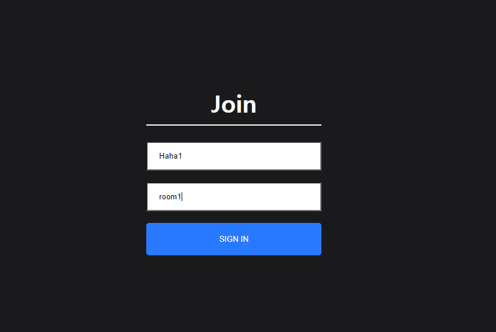
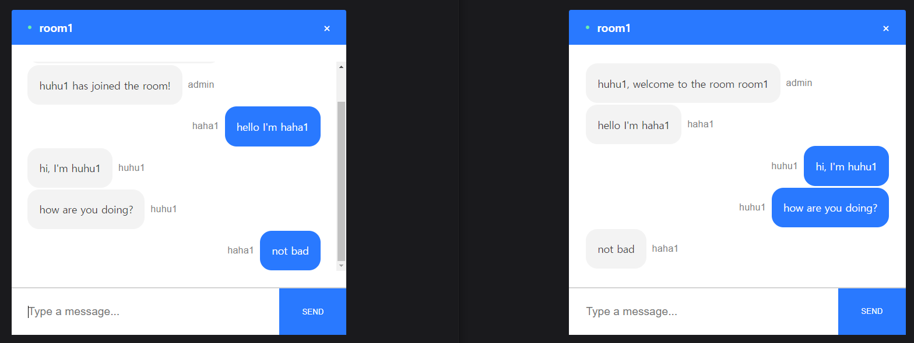
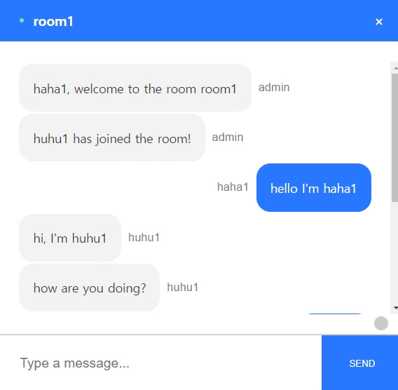

# Realtime_Chat

Realtime Chat web application(ReactJS, NodeJS, socket.io)

## 구현 기능

1. 방 생성
2. 방 참가(같은 room name)
3. 참가 인원 목록
4. 채팅(admin, users)
5. scroll 기능

## Screen shots

### - Join page

### - Chatting Page

### - Chatting & Scrolling

